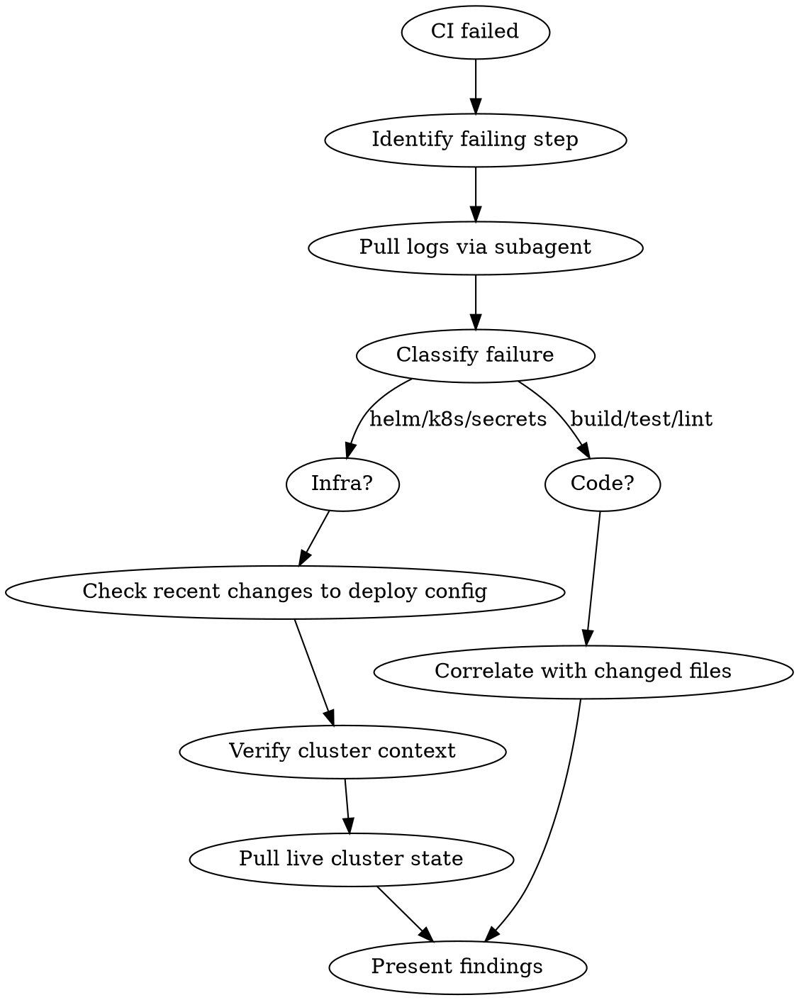
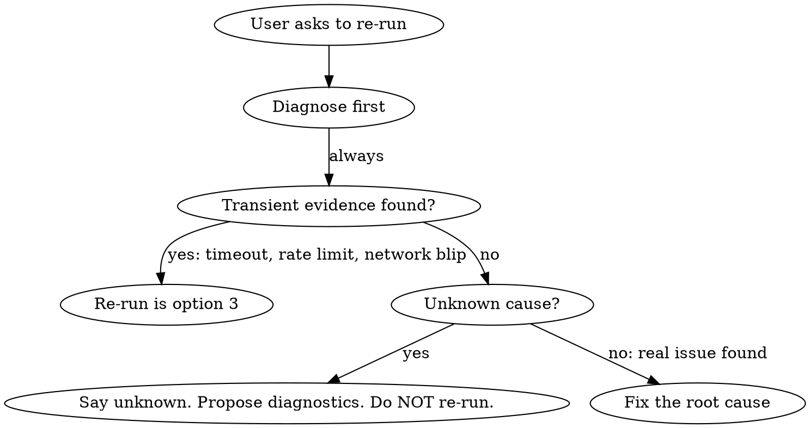

# Debugging CI Failures

## Overview

Diagnose CI failures through structured root-cause analysis. Never suggest re-running without first classifying the failure and finding evidence of a transient cause.

## Diagnosis Flow



### 1. Identify the failure

```bash
gh run view <id> --json jobs --jq '.jobs[] | select(.conclusion == "failure") | {name, conclusion, steps: [.steps[] | select(.conclusion == "failure") | .name]}'
```

### 2. Pull failing step logs (ALWAYS via subagent)

Delegate to a subagent to avoid context bloat:

> "Read the logs for workflow run `<id>`, job `<job>`. Extract ONLY the error messages, stack traces, and the 10 lines before each error. Return a summary under 50 lines."

**NEVER** dump raw `gh run view --log` into main context.

### 3. Check recent changes

Before touching the cluster, diff deploy-related files against main:

```bash
git diff main -- .github/workflows/ helm/ Dockerfile docker-compose* values*.yaml
```

Changed resource limits, new env vars, or modified workflow steps are often the root cause.

### 4. Classify the failure

| Category | Signals | Next step |
|----------|---------|-----------|
| **Helm stuck** | `FAILED`, `PENDING_UPGRADE`, `PENDING_ROLLBACK` | helm history, check for stuck hooks |
| **Secrets missing** | `env var not found`, `CrashLoopBackOff` + config errors | Check ExternalSecret resources, pod logs |
| **OOM/Scheduling** | `OOMKilled`, `Insufficient cpu/memory`, `FailedScheduling` | Check resource limits in helm values, node capacity |
| **Health checks** | Probe failures, `/livez` non-200 | Pod logs for startup errors, probe config |
| **Image build** | Docker build step fails | Dockerfile changes, dependency issues |
| **Test/Lint** | Non-zero exit code from test runner or linter | Read failure output, correlate with changed files |
| **Transient** | Network timeouts, registry rate limits, "connection reset" | **Only** category where re-run is primary action |
| **Unknown** | None of the above | Say so. List what was checked. Propose next steps. |

### 5. For infra failures — pull live cluster state

**First, verify cluster context:**
```bash
kubectl config current-context
```

Then check, in priority order:
1. `helm status <release> -n <namespace>` and `helm history <release> -n <namespace>`
2. `kubectl get pods -n <namespace>` and `kubectl describe pod <failing-pod> -n <namespace>`
3. `kubectl get events -n <namespace> --sort-by=.lastTimestamp | tail -30`

Find the namespace from the workflow YAML or helm values — do not guess.

### 6. Present findings

Use this exact format:

```
## CI Failure Diagnosis

**Workflow:** <name> | **Run:** #<id> | **Branch:** <branch>
**Failing step:** <step> (step X of Y)

### Classification: <category from matrix>

### Evidence
- <specific log lines, pod events, or helm status supporting classification>

### Root Cause
<one paragraph: what went wrong and why>

### Recommended Actions
1. <primary fix>
2. <alternative>
3. <re-run — ONLY if transient evidence found, with explanation>
```

## Re-run Rules



- Re-run requires **positive evidence** of a transient cause (network timeout, rate limit, connection reset)
- "I don't know why it failed" is **NOT** grounds for re-run — that's Unknown
- Unknown means: list what was checked, what was ruled out, and propose next diagnostic steps
- Never say "just re-run" as the first or only recommendation

## Red Flags - STOP

- About to suggest re-run without reading logs first
- About to dump raw `gh run view --log` into main context
- About to run kubectl/helm without verifying cluster context
- About to say "probably flaky" without transient evidence
- Classifying as "Unknown" but still suggesting re-run
- Guessing namespace instead of reading it from workflow/helm config

## Rationalizations

| Excuse | Reality |
|--------|---------|
| "It's probably flaky" | Prove it. Show the transient signal. |
| "Re-running is faster" | Re-running a real failure wastes more time. |
| "The logs are too noisy" | Use a subagent to extract errors. That's what they're for. |
| "I can't tell what failed" | That's Unknown, not Transient. Investigate deeper. |
| "It worked before" | Something changed. Diff deploy config against main. |
| "Let me just check one more thing" | Follow the flow. Don't skip classification. |
