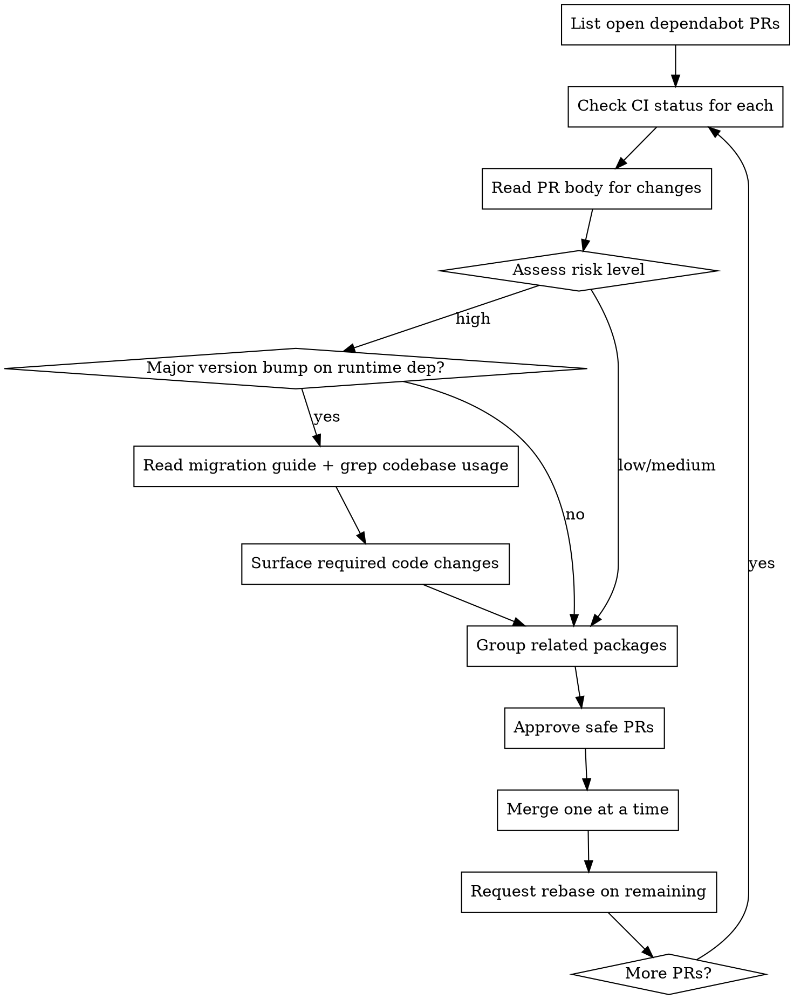

# Dependabot PR Review

## Overview

Systematically triage and merge dependabot PRs by assessing risk, checking CI, and coordinating related updates.

## When to Use

- User asks to "review dependabot PRs" or "check on dependabot"
- Multiple dependabot PRs are open
- After merging PRs, to handle cascading rebases

## Process



## Risk Assessment

| Factor       | Low Risk                   | Medium Risk            | High Risk                      |
| ------------ | -------------------------- | ---------------------- | ------------------------------ |
| **Dep type** | devDependency              | dependency             | dependency with breaking       |
| **Version**  | patch (x.x.1→x.x.2)        | minor (x.1→x.2)        | major (1.x→2.x)                |
| **Package**  | linters, formatters, types | build tools, test libs | framework, runtime             |
| **Changes**  | bug fixes, types           | new features           | breaking changes, deprecations |

### Major Version Bumps on Runtime Dependencies: Required Migration Check

**CI passing is not enough.** CI proves the code compiles — it does not prove behavior is unchanged. A new default, a renamed config option, or a removed implicit behavior will pass CI and silently break production.

For every major bump on a runtime/production dependency, before recommending merge:

1. **Read the migration guide.** The PR body usually links one. If not, fetch the package's GitHub releases page for the version range. Use the `docs-researcher` agent.

2. **Grep the codebase for all imports from the package.** Find every file and every API call.

3. **Cross-reference each 💥 breaking change against actual usage.** Be explicit: "Codebase uses X — affected" or "Codebase does not use X — not affected."

4. **Surface required code changes.** If a breaking change affects the codebase, name the files and the exact fix needed. Do not just hand it to the user and say "needs review."

5. **Call out silent behavioral changes.** Some breaking changes don't cause compile errors but change runtime behavior (e.g., a config flag that now does less, new opt-in defaults). Call these out even if CI is green.

**The rationalization to resist:** "CI passes and my initial review says it looks fine." That's how you miss a config option that silently stops forwarding errors to your logging provider.

### Always Flag for Human Review

- Major version bumps on core dependencies (next, react)
- Security advisories (check PR body for CVE mentions)
- Packages that touch production runtime
- Breaking changes mentioned in changelog

### Usually Safe to Auto-Merge

- `@types/*` packages (patch/minor)
- Linters and formatters (eslint, prettier)
- Dev tooling (commitlint, husky)
- Test libraries (vitest, playwright) - patch only

## Commands Reference

```bash
# List all open dependabot PRs
gh pr list -R OWNER/REPO --author "app/dependabot" --state open \
  --json number,title,createdAt,statusCheckRollup

# Check CI status
gh pr checks PR_NUMBER -R OWNER/REPO

# View PR details
gh pr view PR_NUMBER -R OWNER/REPO --json title,body

# Approve PR
gh pr review PR_NUMBER -R OWNER/REPO --approve

# Merge PR
gh pr merge PR_NUMBER -R OWNER/REPO --merge

# Request rebase after merge
gh pr comment PR_NUMBER -R OWNER/REPO --body "@dependabot rebase"

# Trigger dependabot check (UI only)
# Go to: repo → Insights → Dependency graph → Dependabot → Check for updates
```

## Related Package Groups

Merge these together to avoid version mismatches:

| Group             | Packages                                                                       |
| ----------------- | ------------------------------------------------------------------------------ |
| commitlint        | @commitlint/cli, @commitlint/config-conventional                               |
| typescript-eslint | @typescript-eslint/parser, @typescript-eslint/eslint-plugin, typescript-eslint |
| storybook         | storybook, @storybook/\*, @chromatic-com/storybook                             |
| testing-library   | @testing-library/react, @testing-library/dom                                   |
| vitest            | vitest, @vitest/\*                                                             |
| playwright        | playwright, @playwright/test                                                   |

## Common Issues

**CI fails on all dependabot PRs with same error:**

- Check if it's an infrastructure issue (e.g., EKS release name collision)
- Fix infrastructure first, then re-run CI

**PR needs approval but you authored it:**

- Can't approve your own PR via CLI
- Have teammate approve, or merge if branch protection allows

**Merge conflicts after first merge:**

- Request rebase: `gh pr comment PR --body "@dependabot rebase"`
- Wait for dependabot to rebase, then re-check CI

**`@dependabot recreate` doesn't pick up new grouping config:**

- If a PR was created before a grouping config was added (e.g., react group), `@dependabot recreate` reuses the old ungrouped dependency set
- Fix: close the PR entirely and let dependabot create a fresh one from scratch using the current config

## Output Format

Present findings as a table:

```markdown
| PR  | Package                   | Type   | Risk    | CI  | Action          |
| --- | ------------------------- | ------ | ------- | --- | --------------- |
| #34 | @commitlint/cli 20.2→20.4 | devDep | 🟢 Low  | ✅  | Approve         |
| #35 | next 16.1→17.0            | dep    | 🔴 High | ✅  | Flag for review |
```

Legend: 🟢 Low, 🟡 Medium, 🔴 High
