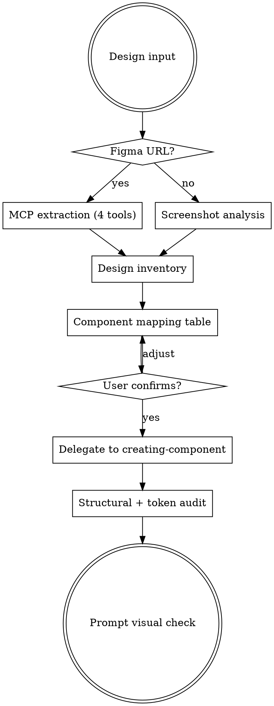

# Figma to Code

## Overview

Extract design intent, map to existing components and tokens, confirm with user, then delegate to `creating-component` for generation. Never skip extraction. Never guess at tokens. Always map before you build.

## Process



### Step 1: Extract

**Figma URL or node selection — run ALL four MCP tools in order (no skipping):**

1. `get_metadata` — component names, hierarchy, variants
2. `get_design_context` — colors, spacing, typography, layout
3. `get_screenshot` — visual reference
4. `get_variable_defs` — token definitions

This applies whether the user pastes a URL or selects a node directly in the Figma desktop app. Either way you'll have a fileKey and nodeId to pass to the MCP tools.

**Screenshot — analyze visually:**

1. Identify every distinct UI element
2. Catalog colors, spacing, typography, layout

### Step 2: Design Inventory

Produce this structured output before any code:

```
### Elements
- [every UI element found]

### Colors
| Design Color | Project Token | Confidence |
|---|---|---|
| Dark text | text-smoke-950 | exact |
| Coral accent | text-watermelon-500 | close |
| Unknown teal | ??? | needs decision |

### Typography
- [mapped to Tailwind classes]

### Spacing
- [mapped to Tailwind spacing scale]

### Unmapped Values
- [anything that doesn't map — ASK the user]
```

Never hard-code hex values. Never use generic Tailwind colors (`gray-*`, `blue-*`, `red-*`) if the project has custom design tokens. If a color doesn't map to an existing project token, ask.

**Confidence rules:** "exact" = hex value matches a token precisely. "close" = description uses a generic color word (e.g., "teal", "coral") that could map to multiple tokens. Anything "close" or below must be confirmed with the user.

### Step 3: Component Mapping

Search the project's component barrel file (e.g., `src/components/ui/index.ts`) and component directories. Present a mapping table:

```
| Design Element | Existing Component | Action |
|---|---|---|
| Primary button | Button (default) | Reuse |
| Text input | Input | Reuse |
| Trip result card | — | Create new |
```

**Decide where new components live:**

- Generic UI primitive → shared component directory (e.g., `src/components/ui/`)
- Domain-specific → feature directory (e.g., `src/features/{domain}/components/`)
- Unclear → ask the user

**WAIT for user confirmation before proceeding.**

### Step 4: Generate

Invoke `creating-component` skill for each new component. It handles conventions, examples, patterns, stories, and barrel file updates.

For pages/layouts, compose from existing + new components with proper imports.

### Step 5: Audit

1. **Structural** — every element from the design inventory exists in code
2. **Token** — every color in the generated code is a project token (no hex, no generic Tailwind)
3. **Code** — invoke `verifying` skill
4. **Visual** — tell the user to check the component visually against the design (Storybook, dev server, etc.)

## Red Flags - STOP

- About to write code without completing extraction
- About to skip any of the 4 MCP tools
- About to use a hex color or generic Tailwind color
- About to generate code without presenting the mapping table
- Proceeding without user confirmation on the mapping

## Rationalizations

| Excuse                                   | Reality                                                                   |
| ---------------------------------------- | ------------------------------------------------------------------------- |
| "I can see enough from the screenshot"   | Run all 4 MCP tools. Variables and metadata reveal what screenshots hide. |
| "This color is obviously smoke-600"      | Map it in the inventory. Obvious guesses are often wrong.                 |
| "No existing components match"           | Search the barrel file. Something usually fits.                           |
| "I'll check existing components as I go" | Check BEFORE generating. Reuse > Extend > Create.                        |
| "The mapping table is overkill"          | It takes 30 seconds and prevents rework. Always present it.              |
| "This is clearly a UI component"         | Domain-specific components go in features/. Ask if unclear.              |
