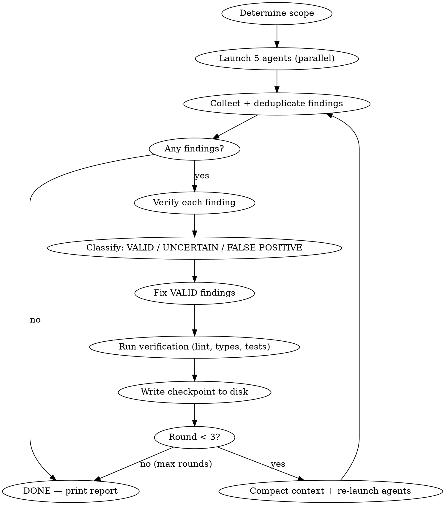

# Review Loop

Automated review-fix-verify cycle. Launches review agents, verifies findings with evidence, fixes what's proven correct, re-verifies, and repeats until clean.

## Two Modes

- `/reviewing-code` — **Pre-commit.** Reviews branch diff for code quality. Fixes issues. Leaves clean working tree for `finishing-work`.
- `/reviewing-code pr` — **Pre-PR.** Same code review + PR readiness checks (description, checklist, CI, branch freshness). Hands off to `creating-pr`.

## Where It Fits

```
Write code (TDD) → verifying → >>> /reviewing-code <<< → finishing-work → /reviewing-code pr → creating-pr
```

## Pre-Commit Mode

### The Loop



**Step 1: Scope.** `git diff main...HEAD` (full branch diff). Override with argument: `/reviewing-code staged` or `/reviewing-code <base-ref>`.

**Step 2: Launch agents.** Use the `review-orchestrator` agent (runs on Sonnet — plugin agents inherit its model):

**CRITICAL:** Run the diff command yourself in Step 1, then include the full diff output directly in the orchestrator's prompt. The orchestrator has no Bash tool — it cannot run `git diff`. If you tell it to fetch the diff, it will fall back to reading every file with Read/Glob, blow up its context, and never reach the sub-agent dispatch step.

The orchestrator launches all 5 pr-review-toolkit agents in parallel and returns deduplicated findings.

**Docs-heavy diffs (primarily `.md` files):** The diff contains no source code, so `comment-analyzer` can only surface-scan without knowing what to verify against. Include the key source files the docs reference in the orchestrator prompt — not just the diff. Example: "These docs make claims about `clientApiService.ts`, `AccountService.js`, and `configureStore.js` — verify behavioral descriptions against those files." Without this, agents check that referenced functions exist but not that the behavioral descriptions are accurate.

Re-run every round. Fixes can cascade across domains.

**Step 3: Deduplicate.** Multiple agents often flag the same code location. Merge overlapping findings into one, keeping the most specific diagnosis.

**Step 4: Verify.** This is where quality lives. See **Verify Each Finding** below.

**Step 5: Fix.** See **Fix Strategy** below.

**Step 6: Verify code.** Run the `verifying` skill (lint, types, tests). Fix any failures before next round.

**Step 7: Loop or stop.** Max 3 rounds. If findings persist after round 3, report them as Deferred.

### Verify Each Finding

**REQUIRED:** Invoke the `verified-analysis` skill before classifying any finding as VALID, UNCERTAIN, or FALSE POSITIVE. It defines the verification matrix (which tool per claim type), confidence gate (what/why/correct fix — all with evidence), structural verification rules (grep before asserting absence, read full functions), and evidence standards.

Do not skip this. Do not inline your own verification logic. The skill exists to prevent the most common false positive patterns.

### Document Dismissed Findings

When a finding is verified as FALSE POSITIVE and is likely to be re-flagged in future reviews (e.g., an intentional design decision that looks like a bug), **ask the user** whether to add an inline comment documenting the rationale. Agents re-flag the same code every round without comments explaining why the pattern is intentional.

Examples of findings worth documenting:
- Bare `catch {}` that's intentional per upstream docs
- Missing `unstable_rethrow` where the throw path is unreachable
- Edge runtime constraints preventing use of a Node.js library
- Supabase SDK internals that handle an error before it reaches user code

**Do not add comments without asking.** The user may prefer to leave code uncommented. But always surface the option — a 1-line comment saves 5 minutes of re-verification on every future review.

### Fix Strategy

**REQUIRED:** Use `superpowers:test-driven-development` for behavioral fixes.

| Finding type | Fix approach |
|---|---|
| Behavioral change (logic, error handling, data flow) | **TDD:** Write failing test → implement fix → confirm green |
| Test gap | **TDD:** docs-researcher for test library API → write test |
| Non-behavioral (comment, type annotation, style) | Direct fix |
| Lint warning | Direct fix (autofix where available) |

### Hard Limits

- **Max 3 rounds.** No negotiation. If findings persist after 3, they go in the report as Deferred.
- **Compact at round 2+.** Write checkpoint, run `/compact`, recover from checkpoint.
- **If ANY change was made in a round, re-run ALL 5 agents.** No "this is too small to re-verify."

## PR Mode (`/reviewing-code pr`)

Same loop as pre-commit, plus PR-specific checks run directly by the skill:

- PR description matches `.github/PULL_REQUEST_TEMPLATE.md`
- Checklist items honestly checked (compare each item against actual work)
- CI status green (`gh run list --branch <branch>`)
- Branch up to date with base (`git fetch origin main && git log HEAD..origin/main --oneline`)

### PR Mode Fix Strategy

| Finding | Fix approach | Approval needed? |
|---|---|---|
| Code findings | Same as pre-commit | No |
| Missing/incomplete PR description | Draft it | **Yes** — show user before pushing |
| Unchecked items that were done | Check them | No |
| CI failures | Investigate + fix | No |
| Branch behind base | Rebase | No |
| Comments, labels, metadata | Draft text | **Yes** — show user before posting |

### PR Mode Handoff

- No PR exists → hands off to `creating-pr` skill
- PR exists → reports "ready to merge" with summary

## Context Management

### Progress Checkpoint

Write to `~/.claude/reviews/<project>/branch-<name>/checkpoint.md` between rounds (project = repo name from `git remote`, e.g. `polish-stash`):

```markdown
# Review Loop Progress
## State
- Branch: <name>
- Round: N of 3
- Scope: git diff main...HEAD

## Round 1 (COMPLETE)
- Fixed: [one-line per finding — file:line, what, evidence]
- Dismissed: [one-line per — file:line, claim, why false]
- Deferred: [one-line per — file:line, why uncertain]
- Verification: lint ✓ | types ✓ | tests 50/50

## Round 2 (IN PROGRESS)
- Finding R2-1: [file:line] [status: PENDING/FIXING/FIXED]
  - Verification: [tool used, result]
  - Fix: [what was changed]

## Next Steps
1. [exact next action]
```

**Progressive compression:** Collapse completed rounds to summaries. Only the active round needs full detail.

### Timing

- **Round 1:** No compaction needed.
- **Round 2+:** Write checkpoint → `/compact` → Read checkpoint → continue.
- **Never lose work state.** Checkpoint before compacting, always.

## Final Report

Print to conversation when done:

```
## Review Loop Complete (N rounds)

### Fixed (X findings)
- [file:line] What was wrong → What was changed
  Evidence: [test added / docs confirmed / code-explorer traced]

### Dismissed (Y findings)
- [file:line] Agent claimed X → Actually Z because [evidence]

### Deferred (Z findings)
- [file:line] Description — uncertain, needs your judgment
  Context: [what verification found]

### Verification
lint: 0 errors, 0 warnings | types: 0 errors | tests: N/N passed
```

## Red Flags — STOP

- "One more round won't hurt" → Max 3. Report remaining and stop
- "This fix is too small to re-verify" → If you changed code, re-run agents
- "I'll skip verified-analysis for this one" → No. Every finding gets verified before classification
- "The agent said so, it's obviously right" → Agents are wrong regularly. That's why verified-analysis exists

## What This Skill Does NOT Do

- **Commit.** That's `finishing-work`.
- **Replace initial verification.** Run `verifying` before this skill.
- **Make uncertain fixes.** UNCERTAIN findings get reported, not fixed.
- **Run more than 3 rounds.** Report and stop.
