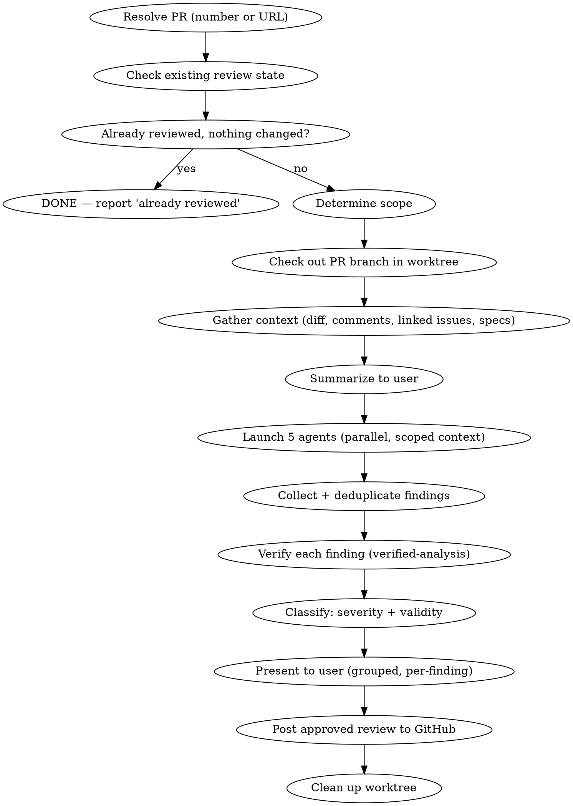

# Reviewing PRs

Review someone else's PR with verified findings. Produces review comments, not fixes. Requires user approval before posting anything.

**Core principle:** Never post a review comment you haven't verified with evidence. Embarrassing false positives damage trust more than a delayed review.

**REQUIRED SUB-SKILL:** Use `verified-analysis` for every finding before classification.

## Invocation

- `/reviewing-prs 123` — PR number (current repo)
- `/reviewing-prs https://github.com/owner/repo/pull/123` — Full URL (cross-repo)
- Natural language: "review Noah's PR", "check PR #42"

## The Flow



## File Storage

Store review artifacts in `~/.claude/reviews/<project>/pr-<number>/` (project = repo name from `git remote`, e.g. `polish-stash`). This keeps diffs, findings, and intermediate state out of `/tmp/` and avoids naming conflicts between concurrent sessions.

## Step 1: Resolve PR

```bash
# PR number (current repo)
gh pr view 123 --json number,title,headRefName,baseRefName,additions,deletions,files,reviews

# PR URL (cross-repo)
gh pr view https://github.com/owner/repo/pull/123 --json ...
```

## Step 2: Check Existing Review State

**REQUIRED before launching agents.** Check for prior reviews by you on this PR.

```bash
gh api repos/{owner}/{repo}/pulls/{number}/reviews
gh api repos/{owner}/{repo}/pulls/{number}/comments
```

| State | Action |
|-------|--------|
| No prior review | Full review (all files in diff) |
| Prior review, no new commits, no responses | Skip — "Already reviewed, nothing changed" |
| Prior review + new commits | Scope to changes since last review |
| Prior review + author responses | Re-review responded threads + new commits |

## Step 3: Check Out PR Branch in Worktree

**REQUIRED before launching agents.** Agents read files from the local filesystem. If the repo is on main, they read main — not the PR code. This produces false positives where agents report "code doesn't exist" for code that is in the PR.

```bash
REPO_ROOT=$(git rev-parse --show-toplevel)
git worktree add "$REPO_ROOT/.worktrees/pr-<number>-review" origin/<pr-branch>
```

All agents must receive the absolute worktree path and be told to read files from there. After the review is posted, clean up:

```bash
git worktree remove "$REPO_ROOT/.worktrees/pr-<number>-review"
```

## Step 4: Gather Context

**REQUIRED before launching agents.** Read the full picture before making any assessments.

```bash
# Full diff scoped to branch vs base
gh pr diff {number}

# All PR comments and review threads (may already be fetched in Step 2 — read them for content now)
gh api repos/{owner}/{repo}/pulls/{number}/comments
gh api repos/{owner}/{repo}/pulls/{number}/reviews

# Linked issues — extract "closes #X", "fixes #X", bare URLs from PR body
gh issue view {linked-number} --json title,body,labels,comments

# Spec/doc links in PR body — fetch and read
```

If a linked issue or spec can't be fetched (private, 404), note it explicitly — don't silently skip.

**Summarize to the user before proceeding:**

```
## PR #42 Context

What it does: [1–2 sentences]
Why: [linked issue summary or stated reason in PR body]
Linked issues: #X — [title]
Key notes from comments: [anything material from existing review threads]
Specs/docs referenced: [links read, or "none"]
```

This context stays with the main agent for synthesis. Do not pass linked issue text or comment threads downstream to review agents — they need fresh eyes on the code.

## Step 5: Launch Agents

All 5 review agents in parallel via Task tool (background). Each gets only what it needs for its job, plus the absolute worktree path so they read the PR code, not the currently checked-out branch:

| Agent | Receives |
|-------|----------|
| `code-reviewer` | diff + worktree path |
| `silent-failure-hunter` | diff + worktree path |
| `type-design-analyzer` | diff + worktree path |
| `pr-test-analyzer` | diff + PR title/description + worktree path |
| `comment-analyzer` | diff + PR comments + worktree path |

## Step 6: Deduplicate

Multiple agents often flag the same code. Merge overlapping findings, keeping the most specific diagnosis.

## Step 7: Verify Each Finding

**REQUIRED:** Invoke `verified-analysis` before classifying ANY finding. Do not skip this. Do not inline your own verification. The skill's verification matrix, confidence gate, and structural rules prevent false positives that would embarrass you in a public review.

**Batch verification agents.** If multiple findings need docs-researcher or code-explorer, launch them in parallel.

### Two-Stage Classification

Each verified finding gets:

1. **Validity** (from verified-analysis): VALID / UNCERTAIN / FALSE POSITIVE
2. **Severity** (VALID findings only):

| Indicator | Severity |
|-----------|----------|
| Bug, security issue, data loss, broken behavior | **blocking** |
| Missing error handling, perf issue, test gap, logic improvement | **suggestion** |
| Style, naming, comment accuracy, minor type improvement | **nit** |

### Classification Output

For each finding, produce:

```
[file:line] VALID blocking / VALID suggestion / VALID nit / UNCERTAIN / FALSE POSITIVE
  Claim: [what the agent said]
  Evidence: [tool used → what it found]
  Reasoning: [why this classification]
  Review comment: [draft text, if VALID]
```

## Step 8: Present for User Approval

**On re-reviews: confirm prior findings first.** Before presenting new findings, verify each prior finding against the current code and show the user what's resolved vs what's new. This prevents confusion where new findings look like rehashes of already-fixed issues.

```
## PR Re-Review — PR #42

### RESOLVED (N prior findings confirmed fixed)
1. ✓ src/file.ts:5 — [original finding] → fixed in abc1234
2. ✓ src/file.ts:42 — [original finding] → fixed in abc1234

### NEW FINDINGS (N comments)
...new findings below...
```

**Grouped by severity, per-finding approval.** Blocking findings first (highest attention while fresh).

```
## PR Review Ready — PR #42 (N comments)

Review action: REQUEST_CHANGES / COMMENT

### BLOCKING (N findings)

1. src/file.ts:line
   [Draft comment text]
   Evidence: [how verified]

   → approve / edit / skip / change severity?

### SUGGESTIONS (N findings)
...same per-finding format...

### NITS (N findings)
...same per-finding format...

### UNCERTAIN (N findings — not posted unless you approve)

N. src/file.ts:line
   [What was found + why uncertain]

   → post anyway / skip?
```

**Per-finding controls:**
- **approve** — include in review as-is
- **edit** — user provides revised text
- **skip** — drop from review
- **change severity** — e.g., "3 → blocking"

**UNCERTAIN findings** are shown separately and NOT posted unless the user explicitly approves them. If posted, prefix with "Worth checking:" to signal lower confidence.

## Step 9: Post Review

After user approves, post a single GitHub review:

- **Review action:** Determined by highest-severity approved finding
  - Any blocking → `REQUEST_CHANGES`
  - Suggestions/nits only → `COMMENT`
- **Inline comments:** Positioned at file:line in the diff
- **Suggestion blocks:** For simple line-change fixes (GitHub's ` ```suggestion ` syntax)

```bash
gh api repos/{owner}/{repo}/pulls/{number}/reviews \
  --method POST \
  --field event=REQUEST_CHANGES \
  --field body="..." \
  --field 'comments=[...]'
```

Then clean up the worktree (see Step 3).

## What This Skill Does NOT Do

- **Fix code.** That's the PR author's job.
- **Post without approval.** Every comment needs explicit sign-off.
- **Loop.** Single pass. Re-run for re-reviews.
- **Replace reviewing-code.** Use that for your own branches.
- **Parse other reviewers' comments.** Only checks your own prior reviews.

## Red Flags — STOP

- "This finding is obviously correct, I don't need to verify" → Verify anyway. verified-analysis exists for a reason.
- "I know how this library works" → Use docs-researcher. Training data goes stale.
- "Let me just post the review and the user can check" → NEVER. Show findings, get approval, then post.
- "I'll skip verified-analysis for this one" → No. Every finding gets verified.
- "The agent said so" → Agents are wrong regularly. That's why this skill exists.
- "I'll present all findings and let the user sort them out" → Group by severity, per-finding controls. Don't dump.
- "The PR is small, I can just read files directly" → Create the worktree. Size doesn't determine whether the branch is merged. Skipping worktrees caused 9/12 false positives in a real review.
- "I'll launch agents first and check the worktree later" → No. Agents read files immediately. Worktree must exist BEFORE any agent launches.
